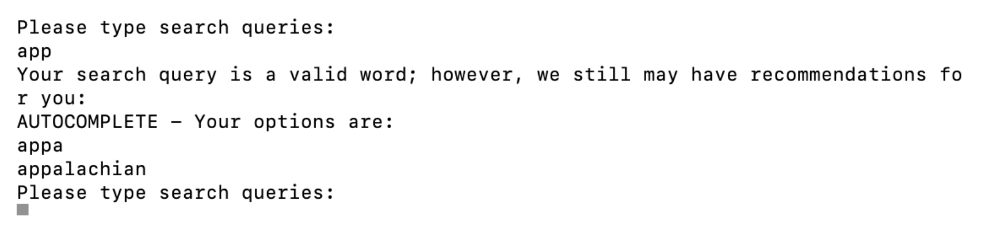
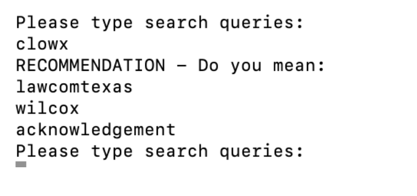

# Word Search - Command Line Interface

## Description

This project provides an implementation of a word search functionality using a Trie data structure and the provided `Dictionary.txt` file. The entire project is written in C++.

The project consists of three main parts:

1. **Trie Creation**: In this part, a Trie class is created from scratch. The Trie class includes a Node class as its component. The Trie class provides methods such as Search() and Insert() to perform operations on the Trie.

2. **Autocomplete**: The second part involves implementing an autocomplete feature. Given a valid word or a valid word prefix, the program suggests autocomplete options based on the words stored in the Trie.

3. **Recommendations**: The last part of the assignment focuses on generating word recommendations for invalid search queries. If the user enters an input that is not a valid word or a valid word prefix, the program generates recommendations based on the similarity between the input and the words stored in the Trie.

## The Project

### Part 0: Assumptions

To start the implementation, two files were created: `Trie.cpp` and `search.cpp`. These files contain all the necessary code for the project.

The search implementation assumes that it only handles individual words. It does not support search terms consisting of multiple words since the `Dictionary.txt` file does not include such terms.

### Part 1: Trie Creation

The `Trie.cpp` file contains the implementation of the Trie class, which includes a root Node object and various methods related to Trie operations. The logic behind the Trie class is as follows:

- The root node is initialized as NULL and has 26 children, each corresponding to a letter in the alphabet.
- Each child node has an array of 26 possible children, initially set to NULL. As words are inserted into the Trie, the nodes and their values are populated.
- The Trie class provides methods for inserting words into the Trie and searching for words within the Trie. Traversal through the Trie is done using both for loops and recursive methods, depending on the specific situation.

The implementation of Part 1 is crucial for the success of Parts 2 and 3, as they rely on the correct functioning of the Trie class.

### Parts 2 and 3: Autocomplete and Recommendations

The `search.cpp` file combines Parts 2 and 3 into a unified interface. Autocomplete and recommendation features are determined based on user input. Here's an overview of the implemented logic:

- If the user enters a valid word or a valid word prefix, the program performs the autocomplete feature.
- If the input is not a valid word or prefix, the program resorts to the recommendation feature.
- The interface allows users to search for terms repeatedly until they enter an exclamation point ('!'). This implementation enhances user-friendliness.
- Autocomplete functionality is achieved by recursively traversing the Trie for complete words that start with the given prefix.
- The recommendation feature ranks words based on their length and the number of letters they have in common with the input. The top three scoring words are then returned as similar word recommendations.

Screenshots of example inputs and outputs are provided to showcase the functionality of the search engine, demonstrating both Parts 2 and 3 in action. These examples highlight the successful loading of words into the Trie in Part 1.

## Screenshots

Here are some examples of inputs and outputs for the Word Search command line interface:

These examples demonstrate the autocomplete and recommendation features, providing users with relevant suggestions and recommendations based on their input.

## How to Run

To run the Word Search command line interface, follow these steps:

1. Clone the repository or download the project files.
2. Compile and build the project (`search.cpp`) using a C++ compiler.
3. Run the compiled executable file, usually named `search.exe` or `search`.

Please ensure that the `Dictionary.txt` file is located in the same directory as the executable file to ensure proper functionality.

Enjoy!
